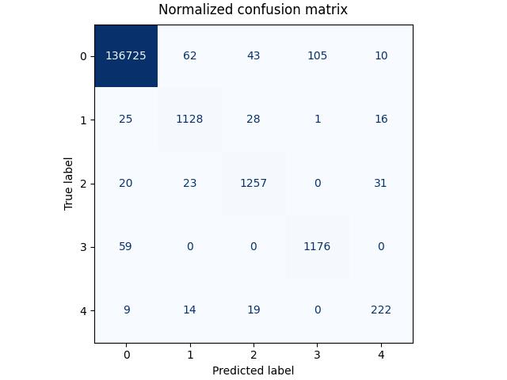

# finer-139-task

- Task: Build a Named Entity Recognition Classifier
- Dataset: [FiNER](https://huggingface.co/datasets/nlpaueb/finer-139)
- Model: [DistilBERT](https://huggingface.co/docs/transformers/model_doc/distilbert)

## Quick-start

Setup your environment using [poetry](https://python-poetry.org/) and Python 3.10.

```shell
export PYTHONPATH=$PYTHONPATH:$(pwd)
poetry install --only app,main --no-root
```

Here are a few ways for you to run the fine-tuned model:

### ONNX
```python
from optimum.pipelines import pipeline

ner_pipeline = pipeline(
    task="token-classification",
    model="model/finer-debt-distilbert-cased/onnx",
    accelerator="ort"
)
```

### Transformers
```python
from transformers import pipeline
ner_pipeline = pipeline(
    task="token-classification",
    model="model/finer-debt-distilbert-cased",
)
```

### Checkout our NER App

```shell
poetry run python src/app.py
# then navigate to http://127.0.0.1:7860/ and play around with this simple NER app
```


## Follow through

Setup your environment using [poetry](https://python-poetry.org/) and Python 3.10.

```shell
# poetry config virtualenvs.in-project true
poetry install
poetry shell
```

Then go through our EDA notebook (feel free to press that Run All button).

Next, it's time to fine-tune the model using our new dataset. I chose to not do that with a notebook, because that's not how I would move to production. Instead, training and serving would be packaged and deployed for orchestration (most probably with Docker). 

```shell
python src/train.py
```

I've trained the model on a RTX3090 (24GB VRAM). Feel free to use mlflow and check the training metrics:

```shell
mlflow ui --port 8080 --backend-store-uri sqlite:///mlruns.db
# then navigate to http://127.0.0.1:8080/#/experiments/0/runs/95cedfd54135453880dfd277799058f9/model-metrics
```

The model looks fairly good, with weighted f1 score of 93% in the test set. A better evaluation would require better business understanding in order to judge recall and precision per class in terms of cost/revenue.

Here is the confusion matrix for the following classes:
```json
{
    "0": "O",
    "1": "B-DebtInstrumentBasisSpreadOnVariableRate1",
    "2": "B-DebtInstrumentInterestRateStatedPercentage",
    "3": "B-LineOfCreditFacilityMaximumBorrowingCapacity",
    "4": "B-DebtInstrumentInterestRateEffectivePercentage",
}
```



And this is final classification report.

|                                                  | Precision | Recall | F1-Score | Support |
|--------------------------------------------------|-----------|--------|----------|---------|
| DebtInstrumentBasisSpreadOnVariableRate1         | 0.92      | 0.94   | 0.93     | 1198    |
| DebtInstrumentInterestRateEffectivePercentage   | 0.80      | 0.84   | 0.82     | 264     |
| DebtInstrumentInterestRateStatedPercentage      | 0.93      | 0.94   | 0.94     | 1331    |
| LineOfCreditFacilityMaximumBorrowingCapacity    | 0.92      | 0.95   | 0.93     | 1235    |
||||||
| **micro avg**                                   | 0.91      | 0.94   | 0.93     | 4028    |
| **macro avg**                                   | 0.89      | 0.92   | 0.91     | 4028    |
| **weighted avg**                                | 0.92      | 0.94   | 0.93     | 4028    |

Finally, the model is converted to onnx. Because no quantization or optimization is applied, the model performance is expected to be the same.

## Throubleshooting

If you're running on a CPU/Mac machine, you can try to update the torch dependency for poetry:

```shell
poetry remove torch
poetry source remove torch
poetry add torch --no-cache
```

## Improvements

Here's a list of things I would do better:

1. Even though the model seems to perform well on the filtered dataset, it would be relevant to measure it's performance against a real testset. Most probably, inputs won't be filtered before classification.
2. This dataset relies heavily on context. I assume these financial documents are much longer than the context accepted by a BERT model, so it would be cool to explore the
performance of LLMs on entire documents.
3. As we can see in the screenshot above for our Gradio App, only the first token for `B-` tag is being annotated, even though the whole number (`2.25`) seems to be the correct answer. That happens because how we are padding the input after tokenization (with `-100`). Maybe 
we should change the strategy and test it.
4. More engineering stuff, like tests and containers.
